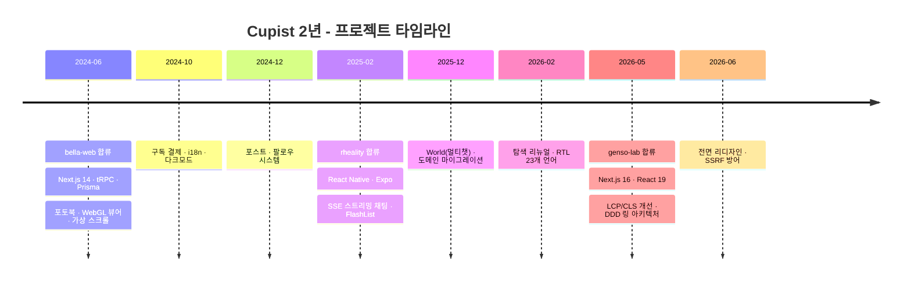
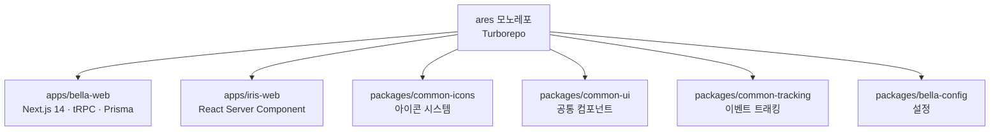
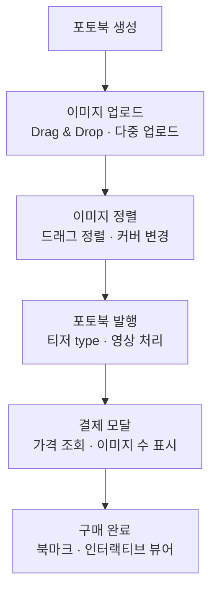
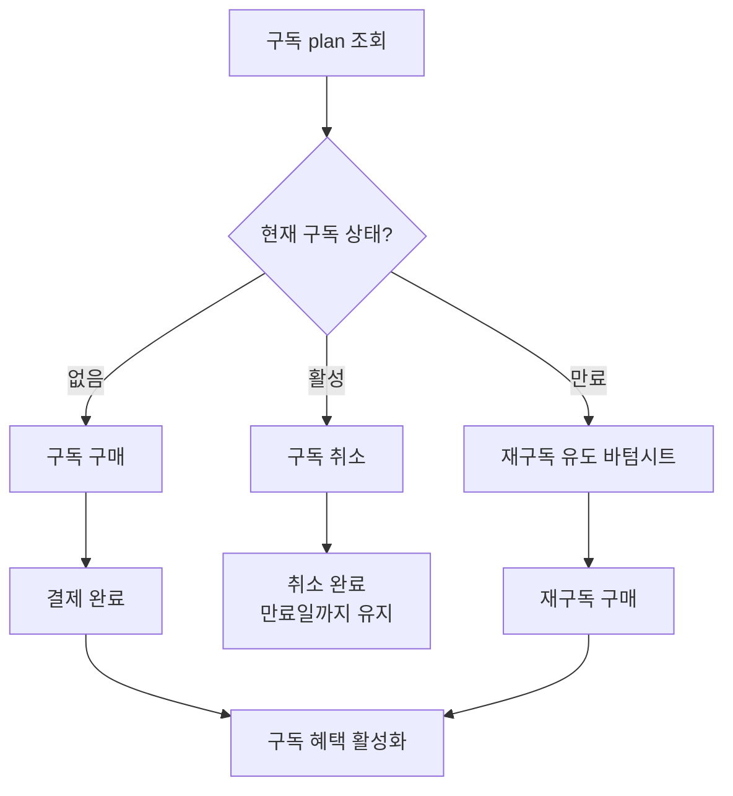
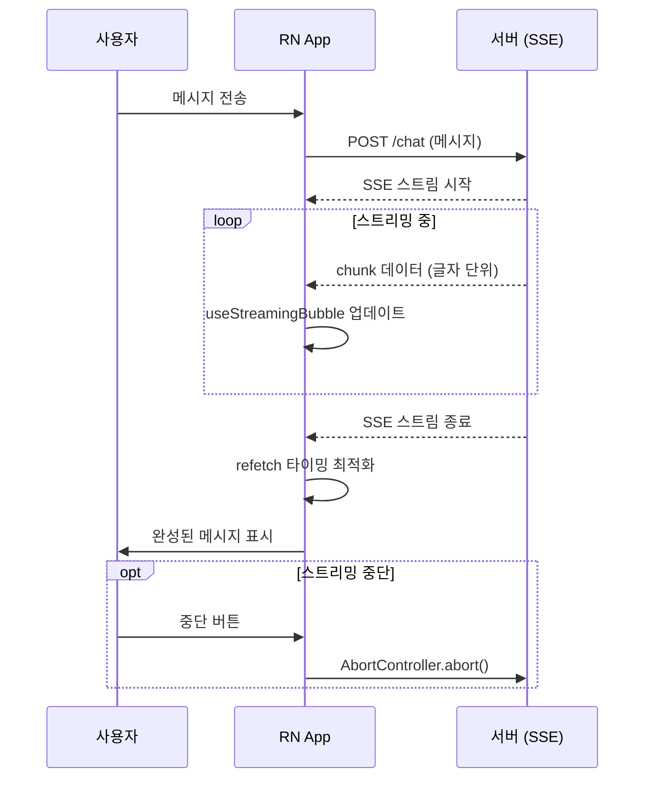
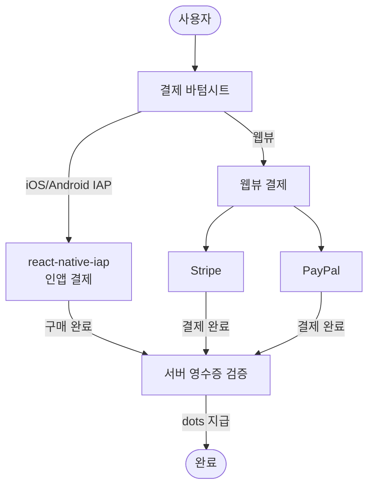
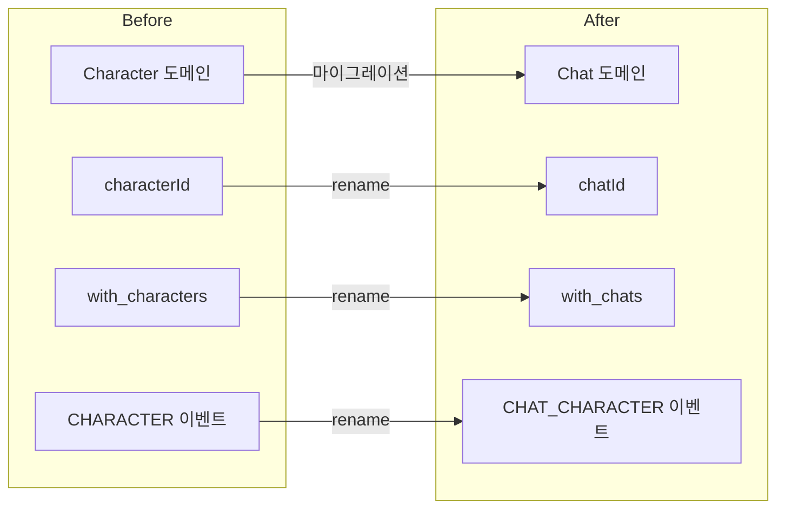
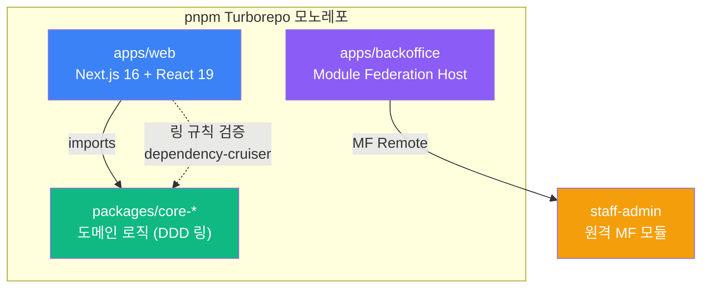
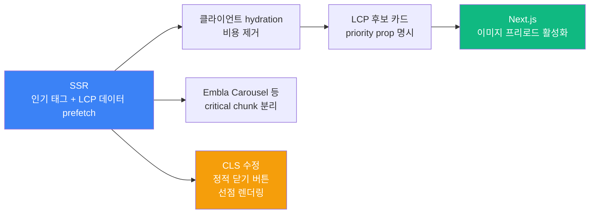

Cupist에 합류한 지 어느덧 2년이 넘었네요. 돌아보니 **bella-web → rheality → genso-lab**, 세 개의 프로젝트를 거쳐왔고, 도메인도 스택도 플랫폼도 매번 달랐습니다. 사내 프로젝트라 화면을 자세히 보여드리기 어려운 게 아쉽지만 😅, 기억이 생생할 때 기록해두고 싶어서 하나의 회고록으로 묶어봤습니다.

흐름을 한눈에 보면 이렇습니다.



---

## 1. bella-web - 모노레포에서 포토북·구독결제까지 (2024)

2024년 6월부터 12월까지 약 반 년간 진행했던 **bella-web** 프로젝트를 회고합니다. 서비스 전체를 처음부터 만들어가는 과정이었는데, 돌아보니 정말 다양한 것들을 해봤더라구요. 사내 프로젝트라 구체적인 화면은 대외비라 일부만.. 참고 부탁드립니다 😅

### 프로젝트 소개

**ares**는 Turborepo 기반 모노레포입니다. 그 안에 **bella-web**, iris-web, 그리고 공통 패키지들이 함께 담겨 있는 구조예요.



저는 주로 **bella-web** 담당이었는데, git 기준으로 보면 전체 파일 변경의 약 80% 이상이 `apps/bella-web`에 몰려있을 정도로 핵심 작업 영역이었습니다.

bella-web의 기술 스택은 이렇습니다.

- **프레임워크**: Next.js 14, React 18
- **API 레이어**: tRPC 10, Tanstack Query v4
- **상태관리**: MobX + Zustand
- **UI**: Chakra UI v2, Framer Motion
- **DB / 인프라**: Prisma, DynamoDB, Redis, AWS S3, Pusher
- **기타**: i18next, Statsig, ffmpeg, **WebGL**

AI 생성 이미지 기반 포토북 판매, 구독 결제, 팔로우, 포스트 콘텐츠 등을 제공하는 크리에이터 플랫폼입니다. 이미지가 핵심 콘텐츠인 서비스다 보니 렌더링 성능에 특히 신경을 많이 썼습니다.

---

### 성능 개선 - 이미지가 핵심인 서비스의 숙명

#### 가상 스크롤 도입

이미지 갤러리처럼 콘텐츠가 많은 목록에서 DOM 노드가 무한정 쌓이면 성능이 급격히 나빠지죠. 저는 factory 이미지 목록에 **가상 스크롤(Virtual Scroll)** 을 처음 적용했습니다. 화면에 보이는 아이템만 렌더링하고 나머지는 가상으로 유지하는 방식인데, 체감 성능이 눈에 띄게 좋아졌습니다 👍

특히 이미지를 **만(10,000) 장 이상** 한 화면에 올려두고 그중 하나를 선택하는 뷰가 필요했는데요, 선택할 때마다 리렌더가 불가피한 상황이었습니다. **가상 스크롤** 덕분에 렌더링 범위가 화면에 보이는 아이템으로만 좁혀지니 리렌더 비용도 많이 아낄 수 있었어요 😊

무한 스크롤도 단계적으로 넓혀갔습니다. 메인 피드에서 시작해서 포토북 리스트, 커스텀 포토까지 순차적으로 확장했어요. 한 번에 다 로딩하지 않고 필요한 만큼만 불러오니 초기 로딩 부담이 많이 줄었습니다.

#### WebGL 인터랙티브 이미지 뷰어

단순히 이미지를 보여주는 걸 넘어서, **WebGL 기반 인터랙티브 이미지 컴포넌트**를 직접 구현했습니다. 2024년 6월에 집중적으로 작업했던 부분이에요.

- canvas를 화면 꽉 차게 설정
- 핀치 줌 / 드래그 이동 기능 구현
- 터치 이동 시 끊김 현상 해결 및 애니메이션 부드럽게 처리

가장 신경 썼던 건 **메모리 누수** 문제였습니다. WebGL은 텍스처 메모리를 명시적으로 해제하지 않으면 계속 쌓이거든요. 이벤트 리스너 등록/해제, WebGL 텍스처 메모리 해제를 꼼꼼하게 처리했습니다. 처음에 이 부분을 놓쳤다가 뒤늦게 발견해서 애를 좀 먹었는데.. 결국 명시적으로 다 처리해서 해결했습니다 😅

완성된 인터랙티브 이미지 뷰어는 포토북과 포스트에도 순차적으로 적용했어요.


#### queryClient 이슈 - 근본 원인을 찾아서

렌더링 안정성 관련해서 가장 기억에 남는 버그가 있습니다. 페이지 이동 시 **queryClient가 초기화되어 버리는 이슈**였는데요. 캐시가 날아가버리니까 API 요청이 계속 반복되는 문제였습니다.

원인은 queryClient 인스턴스가 여러 곳에서 각각 생성되고 있었던 거였어요. 공유 인스턴스 하나로 통합하면서 근본적으로 해결했습니다.

> Tanstack Query를 Next.js와 함께 쓸 때 queryClient 인스턴스를 모듈 레벨에서 싱글턴으로 관리하지 않으면, 페이지 렌더링마다 인스턴스가 새로 생성되어 캐시가 날아갑니다.

그 외에도 로그인 페이지에 **dynamic import** 를 적용해 초기 번들을 분리하고, concept 상세 페이지 **prefetch** 를 추가해서 페이지 전환 체감 속도를 개선했습니다.

---

### 포토북 시스템 - 6개월에 걸친 풀 사이클 개발

포토북은 이 프로젝트에서 가장 오래, 가장 깊게 파고든 기능입니다. 6월 1차 개발부터 10월 안정화까지, 설계·구현·어드민·결제·CRM까지 전 주기를 담당했어요.



초기에는 레이아웃, API mapping, 결제 모달, 북마크 컨트롤바 등 기본 구조를 잡았습니다. 여기에 앞서 만들었던 WebGL 인터랙티브 이미지 뷰어를 포토북에도 붙였어요.

이후 업로드 기능을 붙이는 과정에서 이런저런 이슈들이 생겼는데, 드래그 정렬, 커버 이미지 변경, 영상 파일 처리 등을 하나씩 대응했습니다. Drag & Drop 업로드도 추가하고, 이미지 다중 업로드 API도 연결하면서 업로드 UX가 점점 완성되어 갔습니다.

CRM 레이아웃도 따로 챙겼고, **다크모드**도 포토북 전체에 적용했습니다.

---

### 구독 시스템 - 처음부터 설계하기

2024년 10~11월에는 **구독 결제 플로우**를 처음부터 설계하고 구현했습니다.



구독 plan 조회, 내 구독 정보 API, 구독 구매, 취소, 재구독까지 단계적으로 쌓아올렸습니다. 구독이 만료됐을 때 재구독을 유도하는 바텀시트도 따로 만들었고, 카드가 없을 때 예외처리나 구독 오류 처리 등 결제 안정성을 꼼꼼하게 챙겼습니다.

포스트에서 구독 업그레이드를 유도하는 이벤트도 추가했어요. 유료 콘텐츠를 보려다가 막혔을 때 자연스럽게 구독으로 연결되도록 하는 흐름이었습니다.

---

### 포스트 & 팔로우 - 12월 막판 스퍼트

12월에는 **포스트 콘텐츠 시스템**과 **팔로우 기능**을 연달아 개발했습니다.

포스트는 생성, 관리 레이아웃, 결제 전 화면, 결제 API 연결까지 다 붙였고, WebGL 인터랙티브 이미지도 포스트에 적용했습니다. 다국어(i18n) 지원도 추가했어요.

---

### 인프라 · DX · 공통 모듈

#### 다크모드 전면 적용

2024년 7~8월에는 서비스 전체에 다크모드를 단계적으로 올렸습니다. 메일, 포토북, 설정, 카드 관리, 결제 모달, 메인 페이지 순으로 대응했어요. 첫 페이지 진입 시 다크모드를 강제 적용하는 처리도 추가했습니다.

#### i18n - 다국어 지원

10월부터 **i18next** 기반으로 다국어 지원을 서비스 전반에 넓혀갔습니다. 포스트 리스트, 결제 오류 메시지, 설정 페이지 등에 다국어 텍스트를 추가했고, 언어 변경 버튼을 메인 헤더에 통합했어요.

미로그인 상태에서 언어 변경이 반영 안 되는 버그도 있었는데, 이걸 잡는 데 좀 걸렸습니다. 세션 없이도 언어 설정이 로컬에서 제대로 동작하도록 처리했어요.

#### React Server Component 전환 & 공통 컴포넌트 분리

iris-web과 bella-web 일부에 **React Server Component**를 적용하고, 양쪽에서 공통으로 쓰는 컴포넌트들을 root 패키지로 분리했습니다. 모노레포의 장점을 살리는 작업이었는데, 처음에 공통 컴포넌트 의존성 정리하는 게 좀 번거로웠지만 이후에는 코드 재사용이 훨씬 편해졌습니다 😊

#### 카드 결제 수단 - tRPC에서 REST로

카드 관련 코드는 tRPC 레이어를 제거하고 REST API 방식으로 전환했습니다. 카드 관리가 다른 도메인들과 달리 tRPC로 묶어둘 이유가 없었거든요. 분리하고 나니 훨씬 깔끔해졌습니다.

**번외.** 처음에 카드 부분이 tRPC로 구성되어 있었는데, 결제 쪽 서버 팀과 맞추다 보니 REST가 더 자연스러운 상황이었습니다. 마이그레이션 자체는 크게 어렵지 않았는데, 기존에 tRPC에 묶여있던 에러 처리 로직을 다시 짜야 했던 게 좀 귀찮았네요 ㅋㅋ

---

## 2. rheality - RN 앱에서 SSE 채팅·결제·글로벌화까지 (2025~2026)

bella-web에서 반 년간 웹 프론트엔드를 깊게 파고 난 뒤, 2025년 2월부터는 완전히 다른 플랫폼으로 넘어갔습니다. **rheality(dotdotdot)** - React Native(Expo)로 iOS·Android를 동시 지원하는 글로벌 모바일 앱이었어요. AI 캐릭터와 실시간 스트리밍으로 채팅하는 서비스인데, 결제·다국어·분석까지 통합된 꽤 규모 있는 소비자 앱이었습니다. 출시 **1년 만에 흑자 전환**에 성공하고 **월 매출 15억 원**에 가까운 서비스로 성장했다는 얘기를 들었을 때, 개발자로서 정말 뿌듯했어요 😊 2025년 2월부터 2026년 4월까지 약 14개월간 참여하면서 2,000개 이상의 커밋을 쌓았으니 저한테는 지금까지 가장 오래, 가장 넓은 영역을 다뤄본 프로젝트가 되었네요.

---

### 성능 개선 - 모바일이라 더 중요했던 부분

웹이었으면 크게 신경 안 썼을 것들이 모바일에서는 바로 체감이 되더라구요. 스크롤이 끊기거나 채팅 버블이 뚝뚝 렌더링되면 UX에 직접적인 타격이 오기 때문에, 성능 개선은 초기부터 계속 신경 쓴 부분이었습니다.

#### FlashList로 갈아타기

프로젝트 시작하자마자 `FlatList` 대신 `@shopify/flash-list`를 채택했습니다. 채팅 리스트가 메인이다 보니 아이템 수가 늘어날수록 FlatList의 한계가 금방 드러날 게 뻔했거든요. 첫 달에 채팅 리스트를 FlashList로 교체하고, 이후 Friends 페이지, 탐색 검색 등 ScrollView로 버티던 부분들도 하나씩 FlashList로 바꿔나갔습니다.

```
ScrollView → FlashList 전환 순서
채팅 리스트 (2025-02) → Friends 페이지 (2025-03) → 검색 스와이핑 (2025-11)
```

중간에 `@legendapp/list`도 도입해봤는데, 사용 케이스에 따라 FlashList와 병행해서 쓰는 게 더 유연하더라구요.

#### SSE 스트리밍 메시지 렌더링 최적화

채팅 스트리밍 중에는 메시지 버블이 글자 단위로 업데이트되는데, 이때 컴포넌트 전체가 리렌더링되면 체감상 뚝뚝 끊기는 느낌이 납니다. 이걸 해결하기 위해 스트리밍 버블 로직을 커스텀 훅(`useStreamingBubble`)으로 분리해서 리렌더링 범위를 최소화했습니다.

가장 신경 썼던 건 "스트리밍 중인 메시지만 렌더링되게" 한 부분이었는데요, 전체 메시지 리스트를 다시 그리는 대신 현재 스트리밍 중인 버블만 업데이트 타깃으로 좁혔습니다. 덕분에 스크롤 위치 튀는 문제도 잡을 수 있었습니다 👍

스트리밍 완료 후 refetch 타이밍도 은근히 까다로웠어요. 너무 빨리 refetch하면 서버 응답이 아직 완료 안 된 상태라 빈 값이 오고, 너무 늦으면 UI가 오래된 캐시를 보여주게 되더라구요. 타이밍을 잡는 데 애를 좀 먹었는데 결국 스트리밍 완료 이벤트 기준으로 딜레이를 최소화하는 방향으로 정리했습니다.

#### React Query 캐싱 전략

초기에는 캐싱 전략 없이 매번 API를 때리는 구조였는데, 앱 특성상 캐릭터 목록·탐색 리스트 같은 데이터는 굳이 매번 새로 받아올 필요가 없었습니다. `staleTime`과 `gcTime`을 30초 단위로 조정하고, 즐겨찾기 토글 같은 작은 액션에서 불필요하게 전체 쿼리를 invalidate하던 부분도 제거했어요.

댓글 좋아요·통계 같은 경우는 아예 **Optimistic Update**를 적용해서 서버 응답 기다리지 않고 UI를 먼저 업데이트하게 만들었습니다. 모바일에서는 네트워크 지연이 더 체감되다 보니 이런 디테일이 꽤 중요하더라구요 😀

---

### 핵심 기능들

#### AI 스트리밍 채팅 엔진

프로젝트 첫 달부터 채팅 핵심 로직을 새로 짰습니다. 기존에 `react-native-gifted-chat`을 쓰던 걸 제거하고 처음부터 직접 구현했는데, 써드파티 채팅 라이브러리가 커스터마이징 한계가 명확했거든요.

SSE(Server-Sent Events) 기반으로 실시간 스트리밍을 구현했고, `AbortController`로 스트리밍 중단 기능도 붙였습니다. 글자 하나씩 나타나는 타이핑 애니메이션도 이때 추가했는데 생각보다 완성도 있어 보이더라구요 ㅎㅎ

채팅 되돌리기(Rewind), 재생성, 수정, 삭제까지 붙이고 나니 꽤 완성도 있는 채팅 엔진이 됐습니다.



#### 결제 시스템 - 인앱·웹·Stripe·PayPal

결제가 제일 복잡했습니다. 처음엔 `react-native-iap` 기반 인앱 결제만 있었는데, 이후 웹뷰 결제(Stripe), 인앱+웹 동시 지원, PayPal, Android 웹결제까지 순서대로 쌓이다 보니 결제 레이어가 꽤 복잡해졌어요.



웹결제 중복 처리 버그가 한 번 있었는데, 결제 특성상 중복이 발생하면 바로 CS 이슈로 이어지다 보니 빠르게 잡았습니다. 결제 플로우는 한 번 잘못되면 사용자 신뢰 문제로 직결되어서 항상 조심스럽게 다뤘어요.

**번외.** 인앱 결제와 웹결제를 동시에 지원하는 구조가 된 건 사실 각 플랫폼의 수수료 구조 때문이기도 합니다. Apple/Google 인앱 결제는 30% 수수료가 붙는 반면 웹결제는 Stripe 수수료만 내면 되거든요. 사용자한테 선택권을 주는 동시에 비즈니스 측면에서도 의미 있는 구조였습니다.

#### World(멀티챗) 기능

2025년 12월에 신규 도메인인 World를 설계부터 구현했습니다. 여러 AI 캐릭터와 동시에 채팅하는 멀티챗 개념인데, 기존 1:1 채팅과는 데이터 모델부터 달랐어요. 편집, Draft 저장, 공개 설정, AI 캐릭터 생성 플로우까지 한 달 만에 전체를 올린 게 생각보다 빡셌습니다 ㅋㅋ

#### 탐색 화면 리뉴얼

2026년 2월에 탐색 화면을 전면 리뉴얼했습니다. 세로 스와이프 무한 루프, 온보딩 플로우, 동적 탭 로딩, 캐릭터 댓글, 즐겨찾기까지 한꺼번에 들어갔어요. 이때 탭 활성화 상태 기반으로 데이터를 로딩하는 최적화도 같이 붙였는데, 비활성 탭이 백그라운드에서 계속 쿼리를 날리는 낭비를 막을 수 있었습니다.

#### 글로벌화 - 23개 언어

앱이 글로벌로 확장되면서 다국어 지원을 계속 추가했습니다. 처음엔 영어 중심이었는데, 독일어·스페인어·포르투갈어·루마니아어 순으로 늘어나다가 일본어도 추가됐고, 마지막엔 아랍어 출시에 맞춰 RTL 레이아웃 대응까지 했습니다. 최종적으로 23개 로케일 파일에 번역 키를 관리하게 됐어요.

RTL은 단순히 `textAlign: 'right'` 수준이 아니라 flex 방향, 아이콘 방향, 마진/패딩 반전 등 꽤 넓은 영역을 건드려야 해서 생각보다 손이 많이 갔습니다.

---

### 아키텍처 / 리팩토링

#### Character → Chat 도메인 마이그레이션

2025년 12월에 서버 API 리네이밍에 맞춰 프론트 전체의 도메인 용어를 일괄 교체했습니다. `characterId → chatId`, `with_characters → with_chats`, `CHARACTER → CHAT_CHARACTER` 등등... 규모가 크다 보니 하나하나 바꾸다 빠진 곳이 없는지 검증하는 게 더 힘들었어요.



#### 커스텀 훅 분리

채팅 관련 로직이 컴포넌트 안에 많이 섞여 있던 걸 단계적으로 훅으로 분리했습니다. 스트리밍 버블 훅, 채팅 사이드 이펙트 훅, 스크롤 버튼 훅, 이미지 저장 훅(`useImageSaver`) 등 책임을 나누다 보니 컴포넌트가 훨씬 읽기 편해졌습니다.

`useStorageState`도 JSON 저장용과 plain string 저장용 두 개의 훅으로 분리했는데, 사용처에 따라 타입이 다르다 보니 하나로 합쳐두니까 오히려 사용이 불편했거든요.

#### SuggestEvent 분석 인프라

탐색 화면 리뉴얼과 함께 유저의 스와이프 방향·체류 시간 기반으로 추천 신호를 쌓는 `SuggestEventLogger`를 새로 설계했습니다. `setCurrentViewEvent / accumulate / flush` 흐름으로 이벤트를 누적해두고 적절한 시점에 서버로 보내는 구조인데, `is_negative_signal` 계산 로직을 중앙화하고 중복 이벤트를 통합하는 작업도 같이 했습니다. Suggest API v2로 마이그레이션하면서 timestamp 처리도 개선했고요.

---

### 안정화 / 버그 픽스

#### 채팅 안정성

스트리밍 채팅이 핵심 기능이다 보니 채팅 관련 버그가 꽤 많이 나왔습니다. 채팅 멈춤 반복, 재생성 안되는 이슈, 첫 메시지 안 보내지는 이슈, 중복 요청 방지 등... sequence number 기반으로 메시지 선택 로직을 개선하고 나서야 안정화됐어요. 채팅 rewind, 재생성, 수정이 동시에 돌아가면서 상태가 꼬이는 경우가 있었는데 이 부분이 특히 까다로웠습니다.

#### Android/iOS 크로스 플랫폼 이슈

RN 개발 특성상 Android와 iOS가 다르게 동작하는 케이스가 꽤 많습니다. status bar 색상 변경이 Android에서 안 되는 이슈, iOS에서 키보드 올라올 때 바텀시트 안 올라오는 이슈, Android에서 검색 아이템 터치 안 되는 이슈 등등 플랫폼별로 따로 잡아야 할 것들이 계속 나왔어요.

**번외.** Android 키보드 이슈는 Expo에서 제공하는 `KeyboardAvoidingView` 동작 방식이 Android와 iOS가 달라서 생기는 케이스가 많습니다. `behavior` prop을 플랫폼에 따라 분기처리하는 게 정석이긴 한데, 그럼에도 edge case가 계속 나오더라구요 😅

---

## 3. genso-lab - Next.js 16 / React 19로 새로 시작 (2026~현재)

14개월간의 모바일 앱 개발을 마치고, 2026년 5월부터는 다시 웹으로 돌아왔습니다. 이번엔 **genso-lab** - AI 캐릭터와 대화 기반 스토리를 즐기는 인터랙티브 소설·채팅 플랫폼입니다. 사용자가 에피소드를 탐색하고, 캐릭터와 실시간으로 대화(스토리 룸)하는 서비스인데요. 짧은 기간이지만 꽤 많은 것들을 했다 싶어서 정리해봤습니다.

---

### 스택이 꽤 신선해요

일단 스택부터 말씀드리면 **Next.js 16.1.1 + React 19.2.0 + TypeScript 5.9** 조합입니다. Next 16에 React 19까지 같이 가는 건 현업에서 처음이라 합류하면서 좀 설레더라구요 😀

모노레포는 **pnpm Turborepo**로 구성되어 있고, 앱 레이어(`apps/web`)와 핵심 도메인 패키지(`packages/core-*`)가 분리되어 있습니다. 상태 관리는 **TanStack Query v5 + Zustand v5**, 애니메이션은 **Motion(Framer) v12**, 다국어는 **next-intl**입니다. 테스트는 Vitest + Playwright까지 갖춰져 있어서 꽤 탄탄한 환경이에요.

**DDD 링 아키텍처**를 채택해서 도메인 로직을 앱에서 완전히 분리하고, `verify:architecture` 스크립트로 dependency-cruiser가 링 규칙 위반을 자동 검증해줍니다.



`packages/core-*`는 웹 레이어에 대한 의존성이 없어야 한다는 규칙이 CI로 강제됩니다. ring rule, server-client boundary, no-web-only-imports, no-as-any-at-network-boundary 같은 fitness function을 코드로 자동화해두는 게 팀 프로젝트에서 정말 중요하다는 걸 다시 한번 느꼈어요.

**번외.** backoffice는 **Module Federation host(shell) 앱** 구조입니다. 스탭 어드민 모듈을 원격 MF 모듈로 주입받는 방식인데, Rspack(Rsbuild) 기반으로 빌드 속도도 꽤 빠릅니다. 여기서 제가 한 주요 작업은 genso-engine 변이 후 genso-api 캐시 갱신 알림 구현이었고요, BFF를 `X-Cache-Refresh` 헤더의 단일 권한자로 정리해서 캐시 갱신 실패를 토스트로 노출하는 것까지 마무리했습니다.

---

### 성능 개선이 제일 재밌었어요

이번 포스팅에서 가장 비중 있게 다루고 싶은 부분입니다. 사실 기능 추가보다 성능 개선이 유저 경험에 직결되니까 할 때마다 보람을 느끼더라구요 👍

#### 검색 페이지 LCP / CLS 개선

`perf/frontend-rendering` 브랜치로 대규모 렌더링 파이프라인 개선을 했는데, 그중 검색 페이지 LCP(Largest Contentful Paint)와 CLS(Cumulative Layout Shift) 개선이 핵심이었습니다.



- LCP 후보 카드에 `priority` prop을 명시적으로 전달해서 Next.js 이미지 프리로드를 활성화했습니다.
- SSR 단계에서 인기 태그와 LCP 데이터를 prefetch하고, 클라이언트 hydration 비용을 제거했어요.
- **Embla Carousel** 같은 무거운 의존성은 critical chunk에서 분리(code-split)해서 초기 번들 크기를 줄였습니다.
- CLS 문제는 좀 재밌는 케이스였는데요 - 로드 중에 동적 요소가 갑자기 나타나면서 화면이 흔들리는 이슈였습니다. 정적 닫기 버튼을 먼저 렌더링해서 레이아웃을 선점하는 방식으로 해결했어요.

> 검색 화면이 **동적 렌더링을 의도적으로 유지**하는 이유는 주석으로 명문화해뒀습니다. edge 캐시를 미사용하는 의도인데, 이런 걸 코드에 남겨두지 않으면 나중에 누군가 "왜 SSG 안 썼지?" 하면서 바꿔버리는 경우가 생기거든요 😅

#### 에피소드 상세 hydration 최적화

상세 라우트에 SSR prefetch + hydration을 적용해서 메타데이터와 hydration 중복 fetch를 제거했습니다. 비로그인(익명) 사용자 hydration 오류도 같이 수정했어요.

#### 스토리 룸 스트리밍 성능

실시간 채팅이라 스트리밍 중 리렌더가 많으면 사용자가 바로 느끼거든요. 이 부분을 집중적으로 잡았습니다.

- 채팅방 콜백과 carousel plugin의 **identity를 안정화**해서 스트리밍 중 불필요한 리렌더를 차단했고
- 인풋 바를 격리(isolate)해서 상위 컴포넌트 리렌더가 인풋에 영향을 못 주도록 했습니다 (`SPEC-PERF-001`)
- `ImageOverlaySpeech` onLoaded 핸들러 memoize, auto-submit effect deps도 최소화했어요

**번외.** `media_completed` SSE 이벤트 수신 즉시 이미지를 렌더링하도록 했는데, 이전엔 딜레이가 있어서 이미지가 뒤늦게 뚝 떨어지는 느낌이었거든요. 이제는 SSE 이벤트 수신 타이밍에 딱 맞게 나오니까 체감이 꽤 다릅니다 😊

#### 폰트 + 카드 memoization

**Pretendard** 폰트를 셀프 호스팅 + 비동기 로드로 전환해서 외부 CDN 의존을 없앴고, `EpisodeCard.memo` 유지를 위해 카드 아이템 리스트도 memoize 처리했습니다.

---

## 2년을 돌아보며

세 프로젝트를 나열해놓고 보니, 생각보다 일관된 흐름이 있더라구요.

**성능 최적화**가 프로젝트마다 조금씩 다른 모습으로 반복됐습니다. bella-web에서는 DOM 노드 폭증을 막기 위해 **가상 스크롤**을 처음 적용했고, rheality에서는 모바일 특성에 맞게 **FlashList**로 갈아타며 SSE 스트리밍 리렌더를 컴포넌트 단위로 격리했고, genso-lab에서는 **LCP/CLS**라는 지표 기반으로 SSR prefetch와 코드 스플리팅까지 정교하게 다듬었습니다. 같은 고민이 더 세밀한 도구와 기준으로 발전해온 느낌이에요.

**도메인도 매번 넓어졌습니다.** 웹으로 시작해서, React Native로 iOS/Android를 동시에 커버하며 인앱 결제와 RTL까지 붙이고, 다시 Next.js 16/React 19의 최신 웹 생태계로 돌아왔습니다. 매번 새 스택을 배우는 피로감도 있었지만, 그만큼 선택지가 넓어진 것 같아서 결과적으로는 좋았습니다 😊

솔직히 말하면 바쁘게 달려오다 보니 정리를 못 한 부분도 많습니다. 뒤돌아보면 더 깔끔하게 설계할 수 있었을 것들이 보이기도 하고요. 그래도 세 프로젝트를 거치며 "이건 이렇게 하면 나중에 탈이 나더라"는 경험이 쌓였으니, 다음엔 조금 더 나을 거라 믿습니다 ㅋㅋ

오늘 포스팅은 여기서 마치겠습니다 :)
