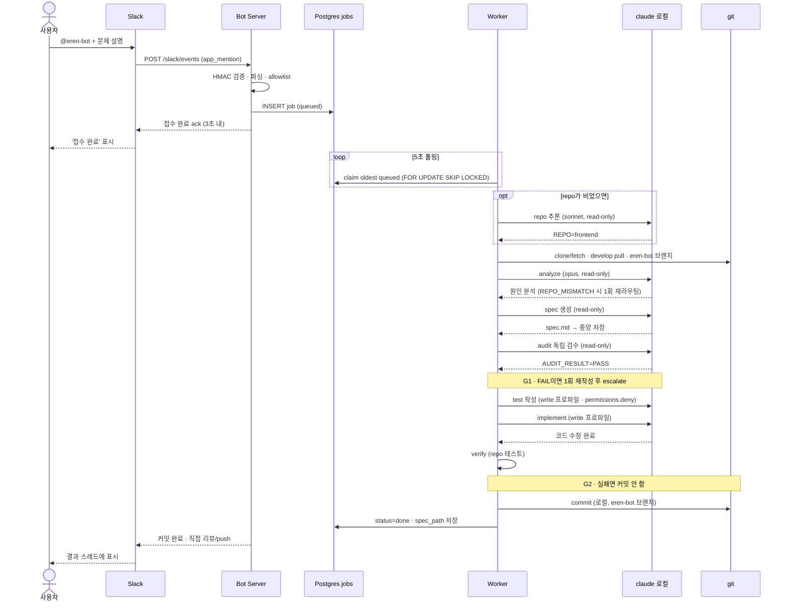

지난 7월, [Workflow Show & Tell 서울](https://workflow-show-tell-seoul-2026.swhan0329.chatgpt.site/ko)이라는 행사에 다녀왔습니다. OpenAI Build Week 기간에 열린 커뮤니티 이벤트였는데, '실전 AI Workflow 8개'라는 부제처럼 여덟 분이 각자 실무에 AI를 어떻게 녹여 쓰는지를 보여주는 자리였죠 😀

그런데 발표를 듣는 내내 한 가지가 계속 걸렸습니다. **아무도 "이 기능을 이렇게 코딩했어요"를 발표하지 않더라고요.** 전부 "이런 일을 대신 해주는 워크플로우를 이렇게 설계했어요"였습니다. 계획, 리뷰, 성능, 데이터, 운영, 거버넌스, 출시까지 주제는 다 달랐지만 공통점은 하나였어요. 손으로 짜는 코드가 아니라, **코드를 짜(거나 검증하)는 과정 자체를 시스템으로 만들어 둔 것**이었습니다.

특히 어느 발표에서 나온 "판단과 검증을 배포한다"는 표현이 오래 남았습니다. 그동안 저는 '개발을 잘하는 것'만 생각했지, '개발하는 나 자신을 자동화하는 것'은 진지하게 고민한 적이 없었거든요. 집에 오는 길에 결론을 하나 내렸습니다.

> 나도 이제 코드만 짜지 말고, 워크플로우를 하나 만들어야겠다.

## 만들기로 한 것: 태그하면 고쳐주는 봇

제 하루의 상당 부분은 Slack에서 흘러갑니다. 버그 제보도, 자잘한 수정 요청도 대부분 메시지로 오죠. 그래서 아주 단순한 그림에서 출발했습니다.

**Slack에서 봇을 태그하고 문제를 말로 설명하면, 봇이 알아서 브랜치를 따고 → 원인을 분석하고 → 스펙을 쓰고 → 코드를 고치고 → 테스트까지 돌린 다음, 나는 마지막에 리뷰하고 push만 한다.**

`@eren-bot` 을 태그하는 순간 아래 흐름이 돕니다.

그림만 보면 그냥 "AI한테 시켜서 코드 짜기"처럼 보이지만, 실제로 시간을 가장 많이 쓴 건 코드가 아니라 **이 흐름을 어떻게 안전하게 굴릴까**였습니다. 컨퍼런스에서 느낀 게 정확히 이 부분이었고요.

## 흐름을 뜯어보면

### 1. 접수는 3초 안에, 실행은 따로

Slack 이벤트 API는 **3초 안에 응답**을 주지 않으면 재전송을 시작합니다. 그런데 봇이 하는 일(clone → 분석 → 구현 → 테스트)은 3초로 끝날 리가 없죠. 그래서 접수(ack)와 실행을 처음부터 분리했습니다. Bot Server는 요청을 받으면 검증만 하고 곧장 큐에 넣은 뒤 "접수 완료"만 돌려주고, 무거운 작업은 Worker가 뒤에서 처리합니다.

### 2. Postgres를 잡 큐로

거창한 메시지 브로커 대신 그냥 Postgres 테이블 하나를 잡 큐로 씁니다. Worker가 5초마다 폴링하면서 가장 오래된 queued 잡을 집어오는데, 이때 `FOR UPDATE SKIP LOCKED` 를 씁니다. Worker가 여러 개여도 **같은 잡을 두 번 처리하지 않도록** 락이 걸린 행은 건너뛰는 거죠. 인프라를 늘리지 않고 중복 실행만 막는 데는 이만한 게 없었습니다 👍

### 3. 읽기 먼저, 쓰기는 나중에

이게 개인적으로 제일 중요하게 생각한 부분입니다. 파이프라인을 **read-only 구간**과 **write 구간**으로 완전히 갈라놨습니다.

- 원인 분석, 스펙 생성, 독립 검수(audit)는 전부 **읽기 전용**으로 돕니다. 이 단계에서는 파일을 단 한 줄도 못 고쳐요.
- 실제로 파일을 건드리는 건 test 작성과 implement 단계뿐이고, 여기서도 write 프로파일 + `permissions.deny` 로 손댈 수 있는 범위를 좁혀둡니다.

"AI가 뭔가 이상한 걸 지르면 어쩌지"라는 불안의 대부분은, 애초에 **지를 수 있는 권한 자체를 단계별로 나눠두는 것**으로 꽤 줄어들더라고요.

### 4. 게이트 두 개

자동화의 핵심은 "잘 돌아가는 것"보다 **"함부로 커밋하지 않는 것"** 이라고 생각했습니다. 그래서 게이트를 두 군데 박았습니다.

- **G1 (검수 게이트)**: 스펙을 만든 주체와 검수하는 주체를 분리해서, audit이 FAIL이면 1회 재작성하고 그래도 안 되면 사람에게 escalate합니다.
- **G2 (테스트 게이트)**: 구현 후 실제 repo 테스트를 돌려서, **실패하면 커밋을 아예 안 합니다.** 초록불일 때만 로컬 브랜치에 커밋이 남죠.

### 5. 사람은 마지막에

봇은 로컬 `eren-bot/` 브랜치에 커밋까지만 합니다. **push와 리뷰는 제가 직접** 하고요. 자동화가 제 판단을 대체하는 게 아니라, 제가 판단할 거리를 잘 차려서 스레드에 갖다주는 구조입니다. 결과가 나오면 Slack 스레드에 "커밋 완료, 직접 리뷰/push" 하고 남겨줍니다.

## 결국 남는 건 '설계'였다

만들면서 든 생각은, 컨퍼런스에서 느낀 것과 정확히 같았습니다. **코드는 이제 봇도 짭니다.** 원인 분석도, 스펙 초안도, 구현도 어느 정도는 맡길 수 있어요. 그러면 개발자인 제가 진짜로 해야 하는 일은 뭘까.

어디까지 자동화하고 어디서 사람이 개입할지, 접수와 실행을 어떻게 끊을지, 어떤 게이트를 어느 지점에 둘지 — 그 **설계**가 남더라고요. "기능 하나를 코딩했다"가 아니라 "판단과 검증의 흐름을 하나 만들어 배포했다"에 가까운 일이었습니다.

아직 갈 길은 많이 남았습니다. 자동 push는 일부러 막아뒀고, 리뷰 코멘트까지 봇이 달게 하거나 repo 추론 정확도를 올리는 것 같은 숙제가 잔뜩이죠. 그래도 방향은 확실해졌습니다. 앞으로는 코드를 짜는 데서 멈추지 말고, **코드를 짜는 나 자신을 시스템으로 만드는 쪽**으로 시간을 써보려 합니다 😅

컨퍼런스 하나 다녀온 게 이렇게 남는 걸 보면, 역시 밖에 나가서 남들 만드는 걸 봐야 하나 봐요.
